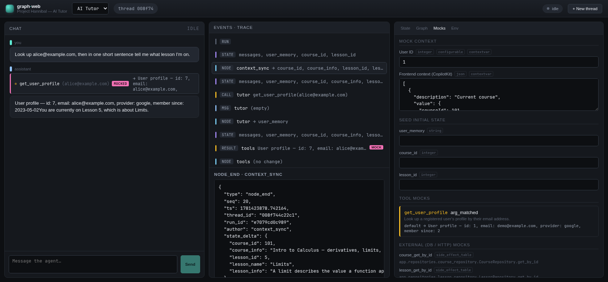

# graph-web

**Run any LangGraph agent in a browser without standing up its world.**

Most LangGraph projects don't graduate cleanly into a playground. The graph reads a JWT claim, looks up a user in Postgres inside a node, pulls config from a request-scoped `ContextVar`, calls three tools that hit live APIs. To "just try it," you historically had to boot the whole backend.

graph-web takes a different bet: point it at your project, declare what the graph depends on, and it imports your compiled graph **in-process** and serves a UI to drive it — with the context, state, tools, and external DB/HTTP calls all **mocked per run**. No real database, no auth, no middleware, no `langgraph dev` server.

You author one file — `graph-web.json` — and that file *is* the contract for how your agent meets the outside world.



---

## Why it's different

LangGraph Studio expects your project to run a `langgraph dev` server and talk to it over the wire. That works when your graph is self-contained. It falls apart the moment runtime context arrives through bespoke channels — `ContextVar`s set by middleware, JWT claims, DB lookups buried in nodes.

graph-web skips the server entirely. It loads your `.env`, imports the graph into the same Python process, and patches every dependency you declare in the manifest. The graph runs exactly as written; the world around it is the part you fake.

```
your-langgraph-project/
  graph-web.json         ← the contract you author
  .env                   ← loaded before your graph is imported
  backend/app/agent/...  ← your StateGraph, untouched
```

What happens on each run:

1. Read `graph-web.json`; load your `.env` into `os.environ`.
2. Add `project_root` to `sys.path`; import your compiled graph (`file.py:symbol`).
3. Apply every declared mock **per run** (nothing leaks between runs) and stream via `astream(stream_mode=["updates","messages","values"])`.
4. Normalize the stream into one event model and push it to the UI over SSE.

Because the import is in-process, **run graph-web inside your project's virtualenv** — the one that already has `langgraph` and your deps. graph-web's own footprint is small: `fastapi`, `uvicorn`, `python-dotenv`.

---

## Quick start

One command builds the frontend (with [bun](https://bun.sh)) and serves the UI and API from a single process on one port:

```bash
# Author a graph-web.json in your project (schema below; a full working
# example lives at project-hannibal/graph-web.json), then:
./scripts/run.sh /path/to/your-project/graph-web.json
#    → http://127.0.0.1:8777   (UI + API, same origin)
```

For frontend work with hot-module reload (vite + backend concurrently; vite proxies `/api`):

```bash
./scripts/run.sh /path/to/your-project/graph-web.json --dev
#    → UI http://localhost:5173 · API http://127.0.0.1:8777
```

`scripts/run.sh` reads `python.venv` from the manifest to pick the interpreter (the backend imports your graph in-process, so it runs inside your project's venv), installs graph-web's backend deps if missing, runs `bun install` / `bun run build`, and launches uvicorn. In serve mode the backend mounts `frontend/dist`; override its location with `GRAPHWEB_FRONTEND_DIST`.

---

## The manifest

`graph-web.json` is the authoritative, fully-declared contract — everything graph-web needs to know about your project is here, and nothing is inferred by magic.

| key | meaning |
|---|---|
| `name` | display name |
| `python.project_root` | added to `sys.path` (relative to the manifest) |
| `python.venv` | which venv to run graph-web in (used by `run-backend.sh`) |
| `env_file` | `.env` loaded into `os.environ` before importing your graph |
| `required_env` / `redact_env` | preflight check / secret masking in the UI (glob patterns) |
| `graphs[]` | one or more graphs |
| `ui` | `default_graph`, `theme` |

Each graph declares:

- **`entrypoint`** — `"file.py:symbol"` (relative to `project_root`). `kind` is `factory` (call it) or `compiled` (use as-is).
- **`state.fields[]`** — `{name, type, default, editable, seed, nullable}`. `seed: true` fields are seeded into the graph input on a fresh run and get a form in the UI.
- **`context[]`** — runtime context the agent receives. Each field declares one or more `inject` targets:
  - `{ "target": "configurable", "key": "user_id" }` → `config["configurable"]["user_id"]`
  - `{ "target": "context", "key": "..." }` → the `context=` runtime arg (LangGraph ≥ 0.6)
  - `{ "target": "contextvar", "import": "pkg.mod:active_user_id" }` → `ContextVar.set(value)`
  - A field may fan out to several targets at once.
- **`tools[]`** — `{name, import: "pkg.mod:tool_obj", mock}`. The mock's `mode` is `static` | `arg_matched` | `passthrough`, with a `default` and arg-matched `matches[]`. graph-web patches the live tool object's `.func`/`.coroutine`, so `ToolNode` calls the mock unchanged.
- **`external_mocks[]`** — patch any dotted path (DB repos, HTTP clients, builders):
  - `mode: "return"` (+`is_async`) — fixed value
  - `mode: "side_effect_table"` — arg-matched `matches[]` with `when_args` / `default`
  - `mode: "dummy"` — return a harmless `MagicMock` (e.g. `SessionLocal()` so `with db_session()` works without a real DB)
  - `mode: "block"` — raise/no-op when called
  - `shape: "object"` wraps dict returns in a recursive attribute object (so nodes can do `course.info`).

See **`project-hannibal/graph-web.json`** for a complete, working example.

---

## How it's built

### Backend

```
backend/graphweb/
  main.py                 FastAPI factory
  settings.py             graph-web's own settings (GRAPHWEB_MANIFEST/PORT)
  manifest/{schema,loader} pydantic manifest models + validation
  project/{env_loader, importer, registry}   dotenv-first import + cache
  mocking/{context, tools, external, attr_object, run_context}
  streaming/{events, normalizer, sse}         LangGraph stream → unified events
  sessions/threads.py     in-memory thread store
  api/{manifest, assistants, threads, runs}   REST + SSE endpoints
```

**REST surface**: `/api/manifest`, `/api/env`, `/api/assistants`, `/api/assistants/{id}/schemas`, `/api/assistants/{id}/graph`, `/api/threads`, `/api/threads/{tid}/state`, `/api/threads/{tid}/runs/stream`.

### Frontend

Vite + React + TypeScript, Zustand store, `@microsoft/fetch-event-source` (SSE over POST), `@xyflow/react` for topology. Custom "Graphite" design system — dark-first, mono-for-data, semantic color rails, tool mocks badged pink.

```
frontend/src/
  App.tsx                 command bar + 3-panel workspace
  store.ts                bootstrap + SSE consumption + run state
  lib/{api,types}
  components/{CommandBar, ChatPanel, TracePanel, StateInspector,
              TopologyView, MockEditor, EnvPanel, FieldRenderer}
```
